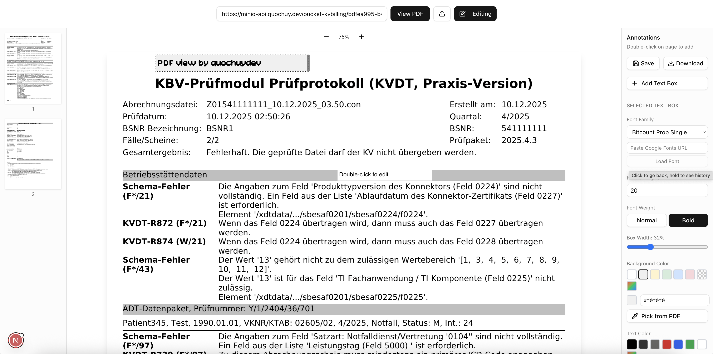

# PDF View

A PDF viewer with annotation support. View PDFs from URL or upload local files, and add text annotations with customizable styling.



## Features

- View PDFs from URL or upload local files
- Add text box annotations with double-click
- Customize font family, size, weight, and colors
- Load Google Fonts via URL
- Move annotations with drag or arrow keys (Shift for faster)
- Resize annotations with Ctrl/Cmd + arrow keys
- Undo changes with Ctrl/Cmd + Z
- Auto-save every 5 seconds
- Download annotated PDF
- Pick colors from PDF with eyedropper

## Getting Started

```bash
npm run dev
# or
yarn dev
# or
pnpm dev
# or
bun dev
```
